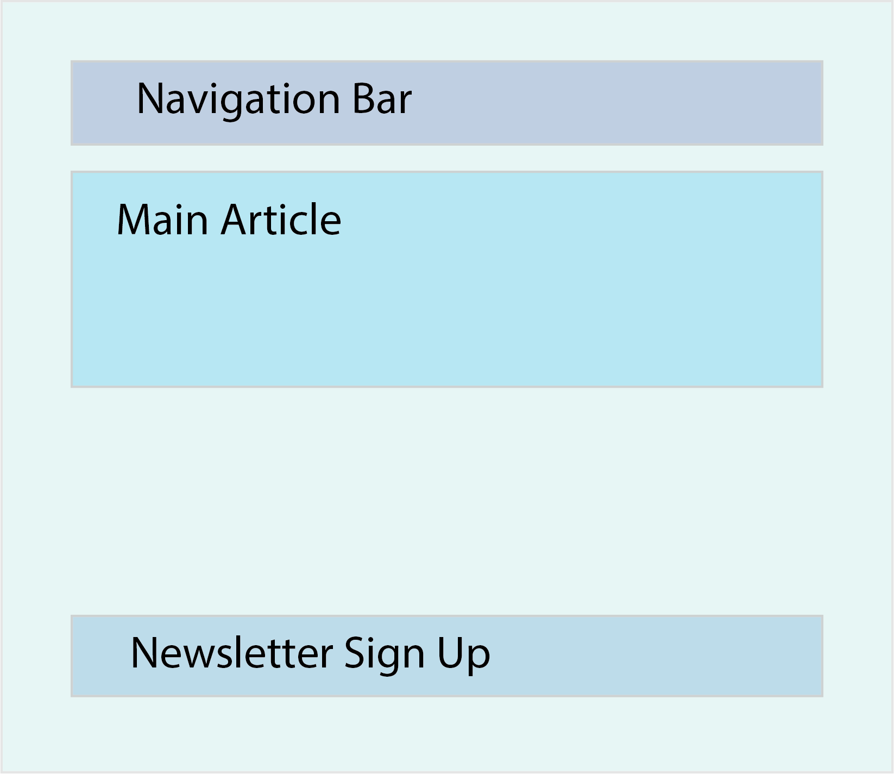

### React Components

Applications built with React are made with (reusable) components. Components are your “building blocks.” To gain confidence using React, you should learn to divide your application or project into these separate components. The following picture gives you an idea of how to do that with a very basic app.



Here, the component is again, written slightly differently:

```
<!DOCTYPE html>
<html>
<head>
  <meta charset="utf-8">
  <title>Hello world</title>
  <!-- Script tags including React -->
  <script src="https://cdnjs.cloudflare.com/ajax/libs/react/15.3.1/react.min.js"></script>
  <script src="https://cdnjs.cloudflare.com/ajax/libs/react/15.3.1/react-dom.min.js"></script>
  <script src="https://unpkg.com/babel-standalone@6/babel.min.js"></script>
</head>
<body>
  <div id="app"></div>
  <script type="text/babel">
    var app = <h1>Hello world</h1>
    var mountComponent = document.querySelector('#app');
    ReactDOM.render(app, mountComponent);
  </script>
</body>
</html>
```
### Babel
In order to use ES6, it's best if we transpile our ES6 JavaScript into ES5 JavaScript to support more browsers.

Babel is a library for transpiling ES6 to ES5.

```
<script type="text/babel">

```

### The React app

Inside the Babel script body, we've defined our first React application. Our application consists of a single element, the <h1>Hello world</h1>. The call to ReactDOM.render() actually places our tiny React application on the page. Without the call to ReactDOM.render(), nothing would render in the DOM. The first argument to ReactDOM.render() is what to render and the second is where:

```
ReactDOM.render(<what>, <where>)
```

### Components and more

At the heart of all React applications are components. The best way to understand React components is to write them. We'll write our React components as ES6 classes.

Let's look at a component we'll call App. Like all other React components, this ES6 class will extend the React.Component class from the React package:

```
class App extends React.Component {
  render() {
    return <h1>Hello from our app</h1>
  }
}
```
- All React components require at least a render() function. This render() function is expected to return a virtual DOM representation of the browser DOM element(s).

In our index.html, let's replace our JavaScript from before with our new App component.

```
<!DOCTYPE html>
<html>
<head>
  <meta charset="utf-8">
  <title>Hello world</title>
  <!-- Script tags including React -->
  <script src="https://cdnjs.cloudflare.com/ajax/libs/react/15.3.1/react.min.js"></script>
  <script src="https://cdnjs.cloudflare.com/ajax/libs/react/15.3.1/react-dom.min.js"></script>
  <script src="https://unpkg.com/babel-standalone@6/babel.min.js"></script>
</head>
<body>
  <div id="app"></div>
  <script type="text/babel">
    class App extends React.Component {
      render() {
        return <h1>Hello from our app</h1>
      }
    }
  </script>
</body>
</html>
```

However, nothing is going to render on the screen. Do you remember why?

We haven't told React we want to render anything on the screen or where to render it. We need to use the `ReactDOM.render()` function again to express to React what we want rendered and where.

Adding the `ReactDOM.render()` function will render our application on screen:

```
var mount = document.querySelector('#app');
ReactDOM.render(<App />, mount);
```